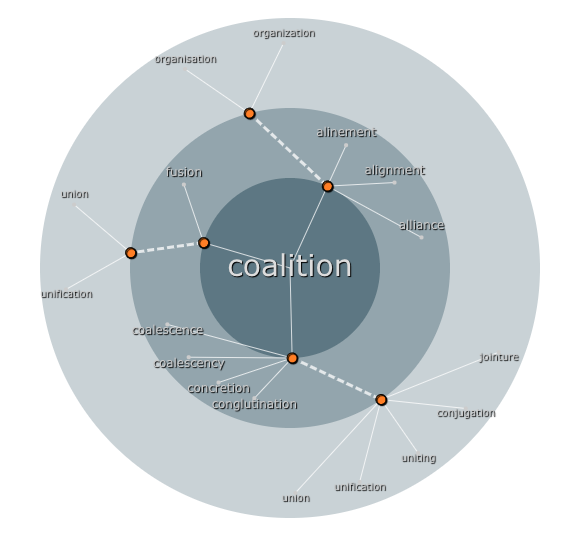

#

<p align="center"> 
  
<p>

# Wordmap

The Wordmap is a tool that enhances vocabulary learning through visual organization, and is a shared module that can be utilized on both Membean and Memseed.

# Install the package using yarn.
 
```
yarn add 'wordmap@https://github.com/membean/wordmap.git#v0.0.7'
 ```
# Install the package using npm

```
npm install 'wordmap@https://github.com/membean/wordmap.git#v0.0.7'
```

>  Note: you must have access to Wordmap repository in order to install it as node package / module.

# Prerequesites

In order to use the Wordmap module, it's necessary to have `create.js` added in your application.

You can add below script to your `index.html` to make it available.

```

<script src="https://cdn0.membean.com/public/vendor/javascripts/createjs-2015.11.26.min.js"></script>

```

# Usage of WordMap

## Using React

1. Create container element

```
import React, {useRef}  from 'react';
...
...
function App() {
  const containerRef = useRef();
  ...
  ...
  ...
  
  return (
    <>
      <div className="container" ref={containerRef}></div>
    </>
  )
  
  ...
}


```

2. Import the Wordmap Module.

```

import Wordmap from 'wordmap';

```

3. Call the `Wordmap` constructor with input containerElement & json data url.
 

```
...
...
  useEffect(() => {
    new WordMap(
      {
        containerEle: containerRef.current,
        url: 'url-to-constellation-json-data'
      }
    )

    return () => {
      containerRef.current.removeChild(containerRef.current.children[ 0 ])
    }
  }, [])
  
...
...
```

4. Style the container with equal width and height so the constellation graph render correctly.

```
.container {
  width: 350px;
  height: 350px;
  background: #2a383d;
  padding: 20px;
}
```

5. [React working example](./examples/react-wordmap-demo)

## Using wordmap with vanilla js

1. Import the `wordmap/bundle.js` in index.html

```
//index.html
<script src="wordmap/bundle.js" type="module"/>

```
OR
```
//index.html
<script src="./node_modules/wordmap/bundle.js" type="module"/>

```

2. Create container element 

```
///index.html

<body>
..
..

<div class="container"></div>

</body>

```

3. Create js script to call `Wordmap` constructor and load in index.html.

```
// app.js

window.addEventListener('load', () => {
  const containerRef = document.querySelector(".container");
  
  new window.Wordmap({
    containerEl: containerRef,
    url: 'url-to-constellation-json-data'
  })
  
})

```

```
// index.html

<body>
...
...
<script src="./app.js" />
</body>

```

4. Style the container with equal width and height so the constellation graph render correctly.

```
.container {
  width: 350px;
  height: 350px;
}
```

5. [React working example](./examples/react-wordmap-demo)


## Configuration

The configuration is used to change how the `Wordmap` behaves. There are properties to load the word map in Interactive and NonInteractive mode.


### Readonly Mode
1. configure wordmap to render constellation with word at center, just static constellation no drilldown to another word.
means click on label will be disable.


```javascript


new Wordmap({
  containerEle: ele,
  mode: 'word',
  url: 'url-to-constellation-json-data'
})

```

### Readonly Mode Question page
2. configure wordmap to render constellation with `?` at center, static constellation with no interaction mostly use in questions page.

```javascript

new Wordmap({
  containerEle: ele,
  mode: 'question',
  url: 'url-to-constellation-json-data'
})

```

### Interactive Mode
3. configure wordmap to render constellation with `word` at center and to make wordmap more interactive.
You have to write logic to maintain the state to enable the forward and backword mode. 
 
 _mostly use in word page._
 
```javascript

new Wordmap({
  containerEle: ele,
  mode: 'question',
  data: jsonData, 
  fetchCallback: callBack // invoke when user click on labels.
})

```

## Options & params

| Property | Type | Type | Description |
|----------|----------|----------|----------|
| containerEle | Object  | Required | A reference to the wordmap container div from the constellation component |
| mode | string  | options | Used to determine the constellation mode, default is 'word' |
| animate | Boolean  | optional | Used to turn animation on or off, default is On|
| url | string  | Required / Optional | Used to fetch the constellation data, `[required]` when constellation need to load in readonly mode like questions. `[optional]` when constellation needs to be interactive, eg to enable click on label |
| data | Object  | Required | Json data to render the constellation graph, `[required]` In case of interactive mode. |
| fetchCallBack | function | Required | A callback fn to fetch the constellation data based on provided word, on invoke it has two params, 1. word, 2. cb to render graph with updated data `[Required]` in case of interactive mode. |
| props | Object  | Optional | Props for constellation component, default is {} e.g. `fullscreen: true/false` |
